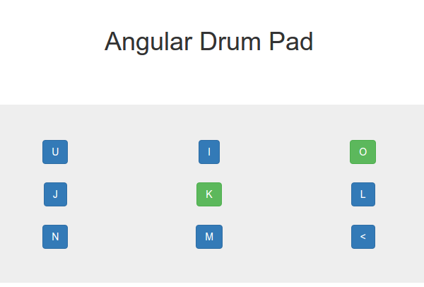

# Angular Drum Pad

A quick-and-dirty drum trigger pad for the browser and keyboard 

## Running this project

Ensure that npm and angular-cli are installed on you machine. You can install angular-cli via 'npm install -g angular-cli@latest'.

Next, navigate to project root and run 'npm install'. Finally, run 'ng serve' and (assuming defaults) navigate to localhost:4200. 

## Screen Capture

## Notice

The audio samples used in this project were distributed by <a href="https://trisamples.com/808-trapstep-pack-vol-1/">TriSamples</a>

